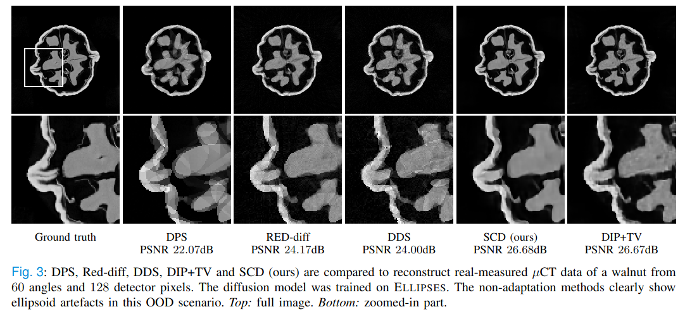

# [Steerable Condtional Diffusion](https://arxiv.org/abs/2308.14409) 

Riccardo Barbano*, [Alexander Denker](https://alexdenker.github.io/)*, [Hyungjin Chung](https://www.hj-chung.com/)*, Tae Hoon Roh, Simon Arridge, Peter Maass, Bangti Jin, Jong Chul Ye


#### Abstract

Denoising diffusion models have emerged as the go-to generative framework for solving inverse problems in imaging. A critical concern regarding these models is their performance on out-of-distribution tasks, which remains an under-explored challenge. Using a diffusion model on an out-of-distribution dataset, realistic reconstructions can be generated, but with hallucinating image features that are uniquely present in the training dataset. To address this discrepancy during train-test time and improve reconstruction accuracy, we introduce a novel test-time-adaptation sampling framework called Steerable Conditional Diffusion. Specifically, this framework adapts the diffusion model, concurrently with image reconstruction, based solely on the information provided by the available measurement. Utilising our proposed method, we achieve substantial enhancements in out-of-distribution performance across diverse imaging modalities, advancing the robust deployment of denoising diffusion models in real-world applications. 





### Method

The goal in SCD is to fine-tune a pre-trained diffusion model to increase the performance on out-of-distribution data. However, we also observe that SCD is able to slighty boost the performance on in-distribution data. 

We exploit LoRA to fine-tune the diffusion model during sampling time, such that Tweedies estimate is consitent with the measurements. In particular, for each sampling step we solve the optimisation problem

$$ \min_{\Delta \theta} \frac{1}{2} || A \hat{x}_0^t(\Delta \theta) - y ||^2 +  \alpha R(\hat{x}_0^t(\Delta \theta)) $$

where $\Delta \theta$ are the LoRA parameter, $A$ the forward operator, $y$ the measurements and $\hat{x}_0^t$ Tweedies estimate at time step $t$. In addition, we can incorporate an additional regulariser $R$, weighted by a parameter $\alpha$. 

## Usage

The pre-trained diffusion models and test data are availabe at 

| Description                          | Path |
|--------------------------------------|------|
| Unconditional diffusion for Ellipses | https://drive.google.com/file/d/1_N_lcsZKkHfSHo31qvHh_c8AwgshGobJ/view?usp=sharing     |
| Unconditional diffusion for AAPM     |  https://www.dropbox.com/scl/fo/mlkwofr24nmsnzixj5u4d/AI-JOLUOAzklINnr8FdKpdk?rlkey=p4bj5ny58tngsjd1j46iyoqh6&e=1&st=lba2c97z&dl=0    |

### Example 

An example for conditional sampling of the **walnut** with a diffusion model trained on synthetic **ellipses**. Here, the forward operator is a parallel-beam Radon transform with 60 angles and we add 5% relative Gaussian noise:

```python
python conditional_sampling.py --train_on=ellipses --test_on=walnut --method=scd --K=16 --r=8   --lr=1e-4  --gamma=0.1  --skip=20 --num_angles=60 --noise_std=0.05 --alphatv=1e-3
```

There are a number of hyperparameters which can be tuned:
```
K: dimensions of the LoRA model 
r: number of adaptation iteration per sampling step
lr: learning rate for LoRA
skip: skip the adaptation at some sampling steps 
    (increase sampling time, but reduce performance)
    skip=1: adaptation is performed at every step
gamma: strength of the regularisation in the conditional step
alphatv: optional, strength of the additional TV regularisation
```


## Citation

If you find this work helpful please cite:

```
@article{barbano2023steerable,
  title={Steerable conditional diffusion for out-of-distribution adaptation in imaging inverse problems},
  author={Barbano, Riccardo and Denker, Alexander and Chung, Hyungjin and Roh, Tae Hoon and Arrdige, Simon and Maass, Peter and Jin, Bangti and Ye, Jong Chul},
  journal={arXiv preprint arXiv:2308.14409},
  year={2023}
}
```